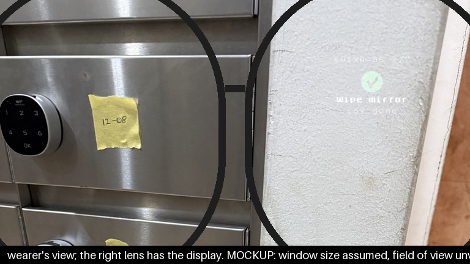

# Millia Glasses

**An AI assistant for the hotel front desk, on smart glasses.** A guest walks up
and starts talking. The receptionist presses a button — and the glasses listen,
recognise who the guest is from the in-house list, show what they're asking for,
and prompt the receptionist for the one thing still missing. When the
conversation ends, every request is already filed as a task another colleague's
phone can claim. The receptionist never looks away from the guest, and never
touches a screen.

**▶ [Watch the demo — 30 seconds](assets/demo-reception.mp4)**



The same glasses follow staff away from the desk: a cleaner works a room
hands-free — *"Millia, done"* ticks the checklist, *"Millia, report: the bedside
lamp is broken"* files a maintenance ticket mid-clean — in whatever language they
speak.

The device is a [Brilliant Labs Halo](https://brilliant.xyz): a round 256×256
see-through display, microphones, a button, Bluetooth — and no network. Everything
it shows and says is decided by **[Millia](https://meetmillia.com)**, an AI-native
property-management system whose agents already run guest messaging, cleaning
coordination, maintenance and billing for real buildings. The glasses are a new
face on that same workforce: every voice command goes through the exact same
permission gates, status machines and task doors a staff member's thumb tap uses
in the phone app. **Zero new tables, zero new write paths** — if the glasses can
do it, it was already allowed.

## How it works

```
 glasses ──BLE──▶ phone ──HTTPS──▶ Millia backend ──▶ transcribe → intent → act
 (draws)  ◀─BLE── (relays) ◀─HTTPS──   (decides)        └─ one Cue: say + show
```

The split is total (ADR 0036, vendored in `docs/adr/`): **the glasses are a dumb
pipe.** `glasses/main.lua` — the entire on-device app, 378 lines — only draws and
reports button presses. The phone (played by a laptop here) relays audio up and a
`Cue` back down. The backend transcribes, decides the intent — a fast-path table
answers common verbs in under a second with no model call; everything else is one
strict structured-output call — acts through existing doors, and answers **in the
language the wearer spoke**.

Two scenes ship, each with a shot list under `glasses/`:

- **Reception** — the button opens a guest session: Millia silently reads the
  conversation, shows the wearer the guest's room and name, asks for what's
  missing (red = won't file without it, orange = a default stands in), and on
  close files every complete request into the team's pool.
- **Cleaning** — a hands-free day: hear your tasks, claim a room by saying so,
  tick steps, confirm counts, file a fault mid-clean without stopping, see a
  reference photo on the optic, get a live badge when a manager reassigns you.

## Run it

```bash
uv sync --dev
cp .env.example .env   # OPENAI_API_KEY for the voice; a staff JWT or dev keys for --login
uv run python scripts/glasses_host.py --login <staff-email>
```

A window opens: the view through one glass, the emulator's framebuffer composited
additively the way a see-through optic works — black is transparent, the text
floats. Click Start and talk: **"Millia, what are my tasks today."** The same
program drives real hardware with one flag (`--hardware`): identical Lua, identical
bytes, the vendor's own BLE framing.

## The engineering

- **Two-tier wake word.** An energy gate segments the mic; a local
  `faster-whisper` tiny model transcribes the last 2.5 s every half-second and
  fuzzy-matches each word against Whisper's real misspellings of "Millia"
  (regex family + edit distance). On a hit the clip is *retroactively trimmed to
  the wake word* and sent up for the backend's second opinion. Room talk that
  never carries the name is dropped unsent.
- **13 BLE chunks per photo.** The display R&D (`docs/research/`) measured the
  real bottleneck — Bluetooth, not pixels: a raw photo is 384 chunks, a 4-bit
  frame 64, a 112 px 16-colour thumbnail **13**. That's the shipped design.
- **Text laid out against a circle.** The Lua app computes the visible chord
  width at every row of the round optic and wraps to it; the R&D harness
  *refuses at build time* to render a line the circle would clip.
- **Latency is a feature.** Every response carries a `timing` map (transcribe /
  context / parse / act / translate, in ms). Fast-path verbs skip the model
  entirely; the intent parse runs with reasoning off (measured 3.65 s → 1.36 s).
- **Stateless multi-turn.** Guest sessions re-send the whole transcript each
  turn; the backend keeps nothing — no session table, no socket, and a retried
  close is idempotent by `client_request_id`.
- **Tested where it hurts.** Pixel-level assertions against the real Lua app in
  the vendor emulator, and race-condition proofs that suspend a fake ASGI backend
  mid-request to freeze the exact in-flight states that once lost a ticket.

---

## The scripted take — read the lines, press Enter

A recording is scripted: the wearer reads each line aloud and the console sends the line as
text on Enter, so Whisper and the end-of-speech wait are out of the loop. A fast-path line
(`done`, `next`, `repeat`, `show`, `start work`, `start work at 2008`, `complete`, `my tasks`,
`where am I`) is one backend round trip; `report`, the form counts and a free question are one
model call each. Every spoken reply is cached on disk under `~/.cache/millia-glasses/voice/`
(keyed by model, voice and text), so a rehearsal fills it and the take plays each known line at
once.

```bash
# The demo tenant's board, measured 2026-08-28: 1213 Departure is assigned to
# the wearer; 1607 and 2008 are B2B and open to anyone. --unassign puts 1607
# back in the pool so the shot list's "I'll take 1607" has something to take.
(cd ../millia && uv run python scripts/glasses_reset_clean.py 1213 1607 2008 --unassign 1607 2008 --yes)  # the reset lives in the backend checkout
uv run python scripts/glasses_host.py --login maria.chrisdemo@millia.test --script glasses/shot-list.txt
```

The reset puts those cleans back to pending in place — every tick, form count,
verdict and timestamp cleared, the tasks' events and chat gone, the rooms dirty,
the day's tickets those wearers reported on those rooms deleted, and the take's
own inbox rows with them (a "Go now" leaves one, and dispatch will not re-fire
while an uncleared one is less than a minute old).

Click Start in the window, then look at the terminal only: it prints the line to read, you
say it and press Enter, Millia answers to the end, the next line is printed. `--pause` paces
the run when stdin is not a terminal (a piped rehearsal).

`--login` mints the wearer's session on the dev project `.env` points at (service role,
magic link) and clocks them in; nothing to copy by hand. A token you already hold goes in
`GLASSES_JWT` instead.

Then: a window opens (800×450) — the lens (`scripts/glasses_window.py`): the view through
one glass. Behind it, out-of-focus light drifting — not a place, only "there is a world
here". The glass itself, pixel for pixel at 1×, sits top right where the optic is, and is
**added** onto the world the way a see-through display works: black is transparent, the
text floats. A purple ring around it while you speak, breathing while Millia thinks.
Millia's reply as a subtitle at the bottom, and nothing else: what you said is not printed
(the room hears it), and there are no numbers. Click Start — the device powers on, Millia
says good morning and waits — then the microphone listens, and you say
**"Millia, …"** — "Millia, what are my tasks today", "Millia, done", "Millia, report: the
bedside lamp is not working". Each utterance goes to `POST /api/v1/glasses/say` on
the dev backend as audio (the phone's path: the backend transcribes and answers in the
language spoken); the Cue comes back; the glass draws it; Millia speaks it. **Only another
"Millia" interrupts her** — she keeps talking through anything else. Open the dashboard and
MOPS beside the window and record the screen with whatever you like.

The ear (`scripts/glasses_ear.py`) opens in two ways, and sends nothing otherwise:

- **The wake word.** An energy gate cuts the microphone into segments
  (`--vad-threshold`, default 0.015 RMS, lower if it never triggers). A segment is
  provisional: nothing lights, nothing is sent. Every half second its last 2.5 s go
  through a small local Whisper (`faster-whisper` tiny, word timestamps, ~0.2 s on an
  Apple-silicon CPU; the model downloads once, ~10 s). When a word is "Millia" — the
  backend's own spelling family judges it (`is_wake_word`: Milia, Melia, Amelia, Ilya,
  Villia, Miria, Maria…) — the segment is cut to start at that word, mid-sentence or not,
  the ring lights, and the clip goes up with `require_wake_word` for the backend's second
  opinion. Room talk that never carries the name closes on silence and is dropped unsent.
- **The follow-up window.** For `--follow-up` seconds (default 4) after Millia finishes a
  line, the next utterance needs no name: the gate arms at once and the clip goes up
  without `require_wake_word`. "Millia, start work" → "Started room 1213, step 1…" →
  "done" → "done" → "report, the lamp is broken." One name per exchange. Silence closes the
  window; her next line opens it again. While she speaks only a wake word gets through.

Something addressed to Millia with no verb in it gets "Come again?" and a fresh window —
never a sentence about not understanding. Room talk outside a window gets nothing.

That is the division of labour for the real device too: **the glasses are the dumb pipe**
— they know that someone spoke or pressed the button, and they send; the backend decides.
(The 2026-08-27 attempt at a laptop gate matched exact spellings and dropped real commands;
this one asks the backend's tolerant matcher per word, with timestamps, and was measured on
a synthesized "…Millia, report the bedside lamp…": found at 1.74 s, none on the part without it.)

Other modes:
- `--script glasses/shot-list.txt` — one utterance per line, no microphone; `--pause` between
  lines. `--type` — type utterances instead. `--say-file clip.wav` — push one 16 kHz mono
  WAV through the ear as if the mic heard it, then exit: how a clip from a real Halo mic is
  replayed through the same gate.
- `--no-speak` for a silent run; `--headless` for no window; `--record out.mp4` writes the
  emulator window to a video file (30 fps) for a run without a screen recorder.
- The film take (`glasses/shot-list-film.txt`): `--read-aloud` speaks a script's lines in two
  voices, in one take, no Enter — the guest's voice is `--guest-voice` (default `ash`) and
  `--gap` is the silence between the two people. `--backdrop room.mp4` puts a looping video
  (or a still) behind the lens — the room the wearer stands in (needs ffmpeg, plays the
  file's own sound); `--ui-from` / `--ui-until` are the seconds into the film where the
  glass and the captions appear and leave, and the take begins at `--ui-from`.

## The clock, and the device budget (measured 2026-08-28)

Where a turn's time goes, transcript in, against the dev backend from the laptop, before
this day's work: context 490 ms; a fast-path verb 520–910 ms; `ask` 10.7 s; a 4.7 s audio
`report` 6.8 s. The verbs were fine. The rest was the model **thinking**: gpt-5-mini spent
192 reasoning tokens and 3.65 s on the parse prompt for "report the bedside lamp"; the same
call with `reasoning_effort="minimal"` took 1.36 s. Every glasses call now runs with
reasoning off; `ask` makes two of them. The transcriber is `gpt-4o-mini-transcribe`
(0.9–1.2 s on that clip; `whisper-1` took 2.1–2.8 s), and the parser names the language
instead. The database reads that do not need each other run together. The route stamps
`timing` on every cue — transcribe, context, parse, act, translate, total, in ms — so the
next person measures from the console, not from a stopwatch.

What still costs, in order: the model calls (about 1.2 s each, one per verb-less turn, two
for `ask`), the transcription (about 1 s), the end-of-speech wait (`--end-silence`, 1.6 s,
by design: a wearer pauses to think), the first sound of the voice (about 0.8 s). A verb
on the fast path skips the model entirely; the more of the wearer's day the fast path
covers, the less the model is on the clock.

**What runs where, for the Halo.** The glasses run `main.lua` only: 22 `frame.display`
calls in the whole file, a redraw only when a message arrives, at most ~30 draw calls per
redraw (the ring is up to 24 small polygons; the firmware's polygon takes 64 numbers, so
each is a 15° piece), a thumbnail of 13 BLE chunks, and a state dot every 400 ms while she
thinks. Nothing on the glasses transcribes, judges or waits on the network. The **phone**
plays what the laptop plays now: the energy gate, the wake-word spotter, the round trip and
the voice. On a phone the spotter is the one cost to watch: `faster-whisper` tiny int8 runs
about 0.24 s per 2.5 s look on this laptop's CPU; on a mid phone expect two to four times
that, so look every second instead of every half second, or let the Halo's hardware
audio-activity detector open the segment and only then spot. The backend's own wake check
stands behind it either way, so a slower spotter costs latency, never correctness.

**On the microphone and the battery.** Halo's mics have a hardware audio-activity
detector (a dB-SPL threshold callback, in the vendor's Lua API), so "always listening" on
the device is that detector waking on sound — the laptop's energy gate, in silicon — not
the radio streaming all day. Clips arrive over Bluetooth at 8/16 kHz PCM or LC3. The button
is the other door. Only the threshold needs tuning on the device; the backend does the rest.
- The tenant needs `mops_config.glasses.enabled = true`; the task must be a cleaning task
  with a checklist; the JWT must belong to a staff member on it. Both routes return 409 when
  the flag is off.

### Measured against the deployed dev backend, 2026-08-27 (room 0712)

The whole shot list ran end to end against the deployed backend — cleaner beats as Maria
Santos, inspector beats as Daniel Tan — with these preconditions, each one a door MOPS
uses too:

1. **The flag**: `mops_config.glasses` was unset on the demo tenant; set to
   `{"enabled": true}` (the other keys untouched).
2. **A token per wearer** — `--login <email>` does this. No JWT secret is on disk, so the
   driver mints a real session: `auth.admin.generate_link(magiclink)` then
   `auth.verify_otp` → `access_token`, carrying `client_id`, `staff_id`, `role`,
   `can_inspect`. It expires in about an hour; run again to mint again.
3. **Clock in first** — the driver does this too (`POST /api/v1/shifts/clock-in`).
   Without it every action is `409 clock_in_required`. The first clock-in of the day posts
   a carry-over line to the tenant's turnover WhatsApp group.
4. **On an unassigned clean the first tick claims and starts it.** "start work" before any
   tick is `403 … claim it first`; after a tick it says "already started". Open with "done".
5. **A form step needs counts, then "yes".** The driver sends the previous line as
   `prior_transcript` after any cue with `needs`; without it "yes" matches nothing.
6. **Inspector beats need a completed clean** and a wearer with `can_inspect`. Pass the
   staged shot as `--photo-url`; the driver attaches it to lines containing pass/redo.
7. With `transcript=` the reply uses the profile locale, so "seterusnya" answers in
   English. Only audio (`file=`) comes back in the spoken language.

A refused door (4xx) is spoken and shown with the question icon; the run does not abort.

## The reception scene — a guest at the desk

The design is `plans/glasses-reception-2026-08-29.md`; the take is
`glasses/shot-list-reception.txt`.

```bash
(cd ../millia && uv run python scripts/glasses_guest_reset.py --yes)  # Mark Robelo in 1013, Amira Hassan in 0712, in stay today; the last take's desk tasks removed
uv run python scripts/glasses_host.py --login ry.chrisdemo@millia.test --script glasses/shot-list-reception.txt
```

The wearer is the receptionist. **The button** — Space in the window, `@button` in a
script, the Halo's own button on hardware — opens a guest session: the ring lights,
the glass says "Listening..", and the ear is held open — every utterance is the
guest's, no name needed. Each line goes to `POST /api/v1/glasses/guest` with the
whole session so far as `prior_transcript` (the backend keeps nothing) and comes back
as what the glass shows: the room large, the guest's name under it (from the in-house
list — the same predicate `mops_guest_list` uses — by the room they named, else by
their name), the requests in the middle band, and at the foot the one thing Millia
still needs: **red** when she will not file without it ("How many towels?",
"Which room?"), **orange** when a default stands in ("When to deliver?" — as soon as
possible). **Nothing is spoken**: Millia observes; the wearer reads the glass and asks
the guest. The button again closes the session: every complete request is filed
through the MOPS FAB door — a `maintenance` ticket for a fault, a `delivery` task for
things to bring (the card names the guest, the count and the time; `due_by` is the
clock time the guest gave), `housekeeping` for the room itself — **unassigned, in the
pool**, `origin = guest_request`, linked to the stay, so a colleague on another phone
accepts it. The glass shows the tick and "2 tasks created". A request with a red
question still open is skipped, and the glass says why. `--guest-silence` (20 s)
without a word closes the session on its own — the clock starts with the first answer
on the glass, not at the button, so a guest may take a moment to begin.

"Millia" said inside a session changes nothing — the words are the guest's — with one
exception: **the receptionist may dismiss the session by voice.** "Millia, dismiss",
"Millia, forget that, I'll do it in the app" — any natural order addressed to Millia —
ends the session without a file: the glass shows "Dismissed", the ring goes off, no close
goes up (so neither the button nor the silence clock can file it), and the next press
opens the next guest's session. The words are the model's call (`dismissed` in the
session schema, decided in the same structured call as the requests); the route and the
host trust that one boolean. A guest withdrawing one item ("no towels after all") is
not a dismissal — the model removes that request and the session goes on.

The lines carry no speaker labels: the crib sheet's `guest:` / `wearer:` prefixes are
stripped before a line goes up, and on hardware one microphone hears both people. The
model works out who spoke from the words; the prompt tells it so, that a repeat-back
("so, four towels by six") is the receptionist confirming and not a new request, and
that a line which could be either and has no earlier support is not filed. The button
is the only act: nothing is filed until it (or the clock) closes the session.

The guest view is message `0x0F` (a colour byte, then room, name, requests, question);
`main.lua` draws the question in the colour and everything else white.

## Notifications — what the phone gets, the glass shows as a badge

Everything MOPS puts in the notification bell reaches the glass, because it is the same
inbox: `GET /api/v1/notifications` (`api/notification_endpoints.py`, staff JWT,
`staff_notifications` filtered to that staff member and that tenant). The laptop polls it
every `--notice-poll` seconds (5; `0` turns it off) for as long as the glasses are on. The
first poll only learns what is already there; every row that lands after it becomes **a
small amber badge**, upper right inside the optic, drawn over the current view (`0x0E`,
one byte on/off) for `--notice-dwell` seconds (6), and the same row as an iOS banner on the
booted simulator (`xcrun simctl push`, the row's own title and body; `--no-phone-banner`).
Nothing is spoken and nothing is pushed off — a read-out notice broke the flow; the words
are on the phone. Nothing is written: the row stays unread.


## Port to a real Halo

One flag: `--hardware`. `make_frame(hardware=True)` returns the vendor's `BrilliantMsg`
(Bluetooth) instead of `EmulatorBrilliantMsg`; every call after that is identical —
`upload_stdlua_libs`, `upload_frame_app`, `start_frame_app`, `send_message`. The bytes on
the wire are the vendor's own framing (`data.lua`) and `TxSprite` (`sprite.lua`), so the
Lua file needs no change. `tests/glasses/test_lua_app.py::test_the_app_touches_only_the_hardware_api_a_real_halo_has`
fails if `main.lua` ever uses something the hardware does not have.

Not verified on hardware: BLE throughput (a 104-px thumbnail is ~13 writes), the optic's
true visible radius, brightness. The emulator mirrors firmware 0.8.8.

## Protocol

| code | direction | payload |
|---|---|---|
| `0x0A` | host → glass | ambient view: `icon` byte, then `top\nmain\nhint` UTF-8 |
| `0x0B` | host → glass | detail view: same payload with `main` empty; the middle band waits for the sprite |
| `0x0D` | host → glass | state: one byte — `0` idle, `1` listening (hollow dot), `2` thinking (pulsing dot) |
| `0x20` | host → glass | the vendor's `TxSprite`, ≤ 104 px a side, 16 colours |
| `0x0F` | host → glass | guest view: colour byte (`0` white, `1` red, `2` orange, `3` green), then `unit\nname\nrequests\nquestion` |
| `0x0C` | glass → host | button: `1` single, `2` double, `3` long — a single press opens or closes a guest session |

Icons: `0` none, `1` tick (green), `2` alert (amber), `3` camera, `4` question.
Codes live in `scripts/glasses_host.py` and are repeated in the Lua header.

## Layout rules (from `docs/research/glasses-display-rnd/`)

- White copy only. Grey vanishes over a white wall on a see-through display.
- Every line fits the round optic: the Lua `chord()` gives the visible width per row.
- The step name wraps onto up to three rows (`128`, `152`, `176`). What still does not
  fit ends with `..`; the spoken cue always carries the whole sentence.
- Keep `main.lua` ASCII. The upload path encodes it as latin-1.
- "Task filed" reads as "Task failed" in the pixel font. The report cue says "Reported".

## Check

```bash
uv run ruff check .      # the monorepo's rules (pyproject.toml); `ruff format` is not run, as there
uv run mypy              # strict, on scripts/
uv run pytest -q         # hermetic; the R&D and window tests skip without ffmpeg
```

## Repo layout

> **Standalone since 2026-08-29.** This repo is the client half: the laptop host
> (`scripts/glasses_host.py`), the ear, the lens window, the Halo Lua app and the
> shot lists. The brain stays in the `millia` backend (`/api/v1/glasses/*`,
> ADR 0036). Two things did not move: the dev-data resets
> (`scripts/glasses_guest_reset.py`, `glasses_reset_clean.py` — they use the
> backend's Supabase client; run them from the `millia` checkout) and the tests
> that drive the real FastAPI route (`tests/scripts/test_glasses_host.py` and the
> route tests of `test_glasses_guest_session.py`). Fonts and the logo are vendored
> under `assets/`. Setup: `uv sync --dev`, copy `.env.example` to `.env`.
